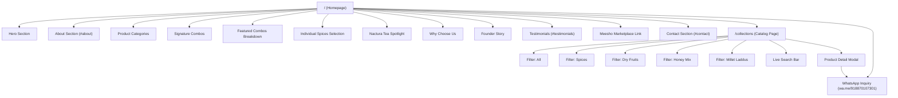
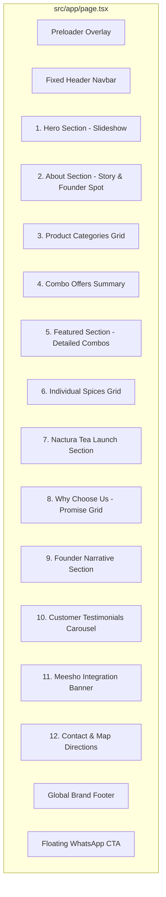

# NACTURA - Website Documentation & Design Index

Welcome to the comprehensive architecture, design system, and implementation documentation for **NACTURA Spices & Dry Fruits**. This document serves as a self-contained reference for developers, designers, and project stakeholders.

---

## 1. Project Overview

### 1.1 Website & Brand Purpose
**NACTURA** is a luxury e-commerce website and digital catalog for premium spices, handpicked dry fruits, wild forest honey, and artisan millet laddus. Sourced directly from estate plantations in the hills of **Idukki, Kerala**, the digital experience is crafted to evoke an aura of uncompromised purity, richness, and luxury. 

The website operates on a **WhatsApp-first commerce model**: instead of traditional online cart/checkout flows, user actions convert into pre-formatted, product-specific WhatsApp inquiry messages sent to the brand's sales team (+91 8870107301). Additionally, the site links directly to the brand's **Meesho** marketplace storefront for standard online payments and delivery.

### 1.2 Target Audience
- **Luxury Culinary Enthusiasts**: Home chefs and food connoisseurs seeking pure, unadulterated spices with authentic aroma and high oil content.
- **Health-Conscious Consumers**: Buyers looking for 100% natural, preservative-free dry fruits, organic wild honey, and low-GI millet sweets.
- **Festive & Corporate Gift Buyers**: Customers purchasing curated spice and dry fruit gift boxes for celebrations and corporate occasions.
- **Local & Regional Shoppers**: South Indian households seeking authentic spices (Cardamom, Black Pepper, Ceylon Cinnamon, Star Anise).

### 1.3 Key Features & Core User Flows
1. **Cinematic Hero Landing**: Immediate visual impression featuring a 5-image background slideshow, brand tagline *"Purity in Every Pinch"*, and direct CTAs.
2. **Brand Origin & Founder Narrative**: Highlighting the estate origin in Idukki, Kerala, and founder **Sharath R**'s commitment to farm-to-table honesty.
3. **Interactive Catalog (`/collections`)**: Complete product catalog featuring 26+ products with category filtering (Spices, Dry Fruits, Honey, Laddus) and instant search.
4. **Rich Product Detail Modal**: Interactive modal with full-screen image gallery, thumbnail selector, hover image zoom, touch swipe, keyboard navigation, aroma profiles, culinary uses, health benefits, and size options.
5. **Direct WhatsApp Ordering**: Dynamic message builder generating pre-filled WhatsApp inquiries specifying item name, desired weight, and delivery details.
6. **Meesho Integration**: Dedicated banner pointing users to Meesho for standard e-commerce purchasing.
7. **Preloader & Smooth Scroll**: Custom circular SVG gold preloader and smooth inertial scrolling powered by Lenis.

### 1.4 Current Implementation Status
- **Frontend Architecture**: **Complete & Fully Functional**. The site contains two main routes ([page.tsx](file:///c:/Users/Arun/Documents/GitHub/nactura-spices-new/src/app/page.tsx) and [page.tsx](file:///c:/Users/Arun/Documents/GitHub/nactura-spices-new/src/app/collections/page.tsx)), responsive across desktop, tablet, and mobile viewports.
- **Backend / Database**: **Not Implemented / Static**. Product catalog data is hardcoded client-side in [page.tsx](file:///c:/Users/Arun/Documents/GitHub/nactura-spices-new/src/app/collections/page.tsx). No dynamic database, CMS, or backend API exists.
- **Cart & Payments**: **Delegated Externally**. Ordering is handled via direct WhatsApp API calls or Meesho marketplace links.

---

## 2. Complete Technology Stack

| Category | Technology | Version | Purpose in Project |
| :--- | :--- | :--- | :--- |
| **Framework** | [Next.js](https://nextjs.org/) | `16.2.12` | React framework with App Router, SSR/SSG, font optimization |
| **Language** | [TypeScript](https://www.typescriptlang.org/) | `^5` | Strict type-safety across components and data interfaces |
| **Core Library** | [React](https://react.dev/) | `19.2.4` | Component-based UI library |
| **Styling Engine** | [Tailwind CSS](https://tailwindcss.com/) | `^4` | Utility-first CSS engine via `@tailwindcss/postcss` |
| **Animation Engine** | [Framer Motion](https://www.framer.com/motion/) | `^12.42.2` | Entrance animations, layout transitions, modal popups |
| **Smooth Scrolling** | [Lenis](https://lenis.studiofreight.com/) | `^1.3.25` | Inertial smooth scroll wrapper initialized in root pages |
| **Icons (Feather/Lucide)** | [Lucide React](https://lucide.dev/) | `^1.27.0` | UI system icons (Menu, X, Leaf, Shield, Crown, etc.) |
| **Icons (FontAwesome)** | [React Icons](https://react-icons.github.io/react-icons/) | `^5.7.0` | Social and action icons (FaWhatsapp, FaInstagram, etc.) |
| **Animation Utility** | [GSAP](https://greensock.com/gsap/) | `^3.15.0` | *Installed dependency* (Framer Motion is primary) |
| **Effects Utility** | [Canvas Confetti](https://github.com/catdad/canvas-confetti) | `^1.9.4` | *Installed dependency* |
| **Build Tooling** | Next CLI / PostCSS | `16.2.12` | Module bundling, image optimization, CSS preprocessing |

### 2.1 Key Dependencies Analysis
- **`next` / `react` / `react-dom`**: Core engine powering Next.js App Router architecture.
- **`framer-motion`**: Extensively used across all 16 UI components for viewport reveal animations (`useInView`), modal popups (`AnimatePresence`), and stagger effects.
- **`lenis`**: Initialized via `requestAnimationFrame` in both root routes for smooth kinetic scrolling.
- **`@tailwindcss/postcss` (v4)**: Uses the `@theme` directive in [globals.css](file:///c:/Users/Arun/Documents/GitHub/nactura-spices-new/src/app/globals.css) to expose theme color variables directly to Tailwind utility classes.

---

## 3. File and Folder Structure

```
nactura-spices-new/
├── .gitignore                    # Git ignore rules for node_modules, .next, etc.
├── AGENTS.md                     # Workspace coding rules & Next.js conventions
├── CLAUDE.md                     # Agent workspace configuration pointer
├── README.md                     # High-level project summary & startup commands
├── eslint.config.mjs             # ESLint flat configuration for Next.js core web vitals
├── next.config.ts                # Next.js configuration (AVIF/WebP image formats enabled)
├── package.json                  # Node.js project manifest & script commands
├── package-lock.json             # NPM dependency lockfile
├── postcss.config.mjs            # PostCSS configuration declaring @tailwindcss/postcss
├── tsconfig.json                 # TypeScript configuration with @/* alias pointing to src/*
├── public/                       # Static public asset directory
│   └── images/                   # Product imagery, logos, hero backgrounds (52 files)
│       ├── 12 premium spices.jpeg
│       ├── 7 premium dry fruits.jpeg
│       ├── cardamom.jpeg
│       ├── hero_1.jpg ... hero_5.jpg
│       ├── logo.png (2.3 MB)
│       ├── logo_preload.webp
│       └── sharath_owner.jpg
├── scratch/                      # Asset preparation scripts
│   └── process_logo.py           # PIL Python script for circular transparent logo processing
└── src/                          # Application source code
    ├── app/                      # Next.js App Router pages and layouts
    │   ├── collections/          # Catalog page route directory
    │   │   └── page.tsx          # Full interactive catalog page & product modal (985 lines)
    │   ├── globals.css           # Design system tokens, @theme config, luxury utilities
    │   ├── icon.png              # Favicon image asset (1.4 MB)
    │   ├── layout.tsx            # Root HTML shell, Google Fonts loading (Cinzel & Inter)
    │   └── page.tsx              # Main homepage landing screen assembling 14 sections
    └── components/               # Reusable UI component library (16 components)
        ├── AboutSection.tsx      # Brand narrative & founder spotlight card
        ├── ComboOffers.tsx       # Signature combo highlights with prices
        ├── ContactSection.tsx    # Address, telephone links, Google Maps & WhatsApp CTAs
        ├── FeaturedSection.tsx   # Detailed 12-spice & 7-dry fruit combo breakdown
        ├── FloatingWhatsApp.tsx  # Fixed bottom-right pulsing WhatsApp action button
        ├── Footer.tsx            # Brand footer, quick links, copyright, social icons
        ├── FounderSection.tsx    # Dedicated narrative story for founder Sharath R
        ├── HeroSection.tsx       # 5-slide background hero slideshow & brand headers
        ├── IndividualSpices.tsx  # 6-item quick spice selection grid with Tamil names
        ├── MeeshoSection.tsx     # Marketplace integration banner for Meesho
        ├── NacturaTeaSection.tsx # Product launch highlight for Nactura Elachi Tea
        ├── Navbar.tsx            # Sticky header navbar with scroll detection & mobile drawer
        ├── Preloader.tsx         # Circular SVG gold progress preloader with percentage counter
        ├── ProductCategories.tsx # 4-card overview grid with animated text reveals
        ├── Testimonials.tsx     # Customer review carousel slider with auto-play
        └── WhyChooseUs.tsx       # 8-card NACTURA promise feature grid with Lucide icons
```

---

## 4. Sitemap and Navigation

### 4.1 Route Table

| Route Path | Type | Purpose | Main Sections | Primary Navigation Links |
| :--- | :--- | :--- | :--- | :--- |
| `/` | Page (Home) | Main brand landing page & interactive story | Hero, About, Collections, Combos, Featured, Spices, Tea, Promise, Founder, Testimonials, Meesho, Contact | `Navbar` links to `/collections`, `/#about`, `/#testimonials`, `/#contact` |
| `/collections` | Page (Catalog) | Complete product catalog & detail modal | Breadcrumbs, Hero Header, Category Filter & Search Bar, Catalog Grid, Product Detail Modal | Header links to `/`, filter pills (`All`, `Spices`, `Dry Fruits`, `Honey Mix`, `Millet Laddus`) |
| `/#about` | Anchor | Scroll target for brand origin | Land on [AboutSection.tsx](file:///c:/Users/Arun/Documents/GitHub/nactura-spices-new/src/components/AboutSection.tsx) | `Navbar` desktop/mobile link |
| `/#testimonials` | Anchor | Scroll target for reviews | Land on [Testimonials.tsx](file:///c:/Users/Arun/Documents/GitHub/nactura-spices-new/src/components/Testimonials.tsx) | `Navbar` desktop/mobile link |
| `/#contact` | Anchor | Scroll target for location & contacts | Land on [ContactSection.tsx](file:///c:/Users/Arun/Documents/GitHub/nactura-spices-new/src/components/ContactSection.tsx) | `Navbar` desktop/mobile link |

### 4.2 Mermaid Sitemap Diagram



### 4.3 Navigation Analysis & Anomalies
1. **Footer Link Mismatch**: [Footer.tsx](file:///c:/Users/Arun/Documents/GitHub/nactura-spices-new/src/components/Footer.tsx) links `"Collections"` to `/#collections` (home category grid) and `"Catalog"` to `/collections`. This provides two distinct behaviors for similar labels.
2. **Cross-Page Hash Navigation**: Clicking `/#about` while on `/collections` successfully navigates to `/` and scrolls to `#about` because Next.js handles route-relative hash links natively.
3. **Missing Pages**:
   - No dedicated individual product routes (e.g. `/collections/cardamom`). Products open exclusively inside a client-side modal.
   - No cart, checkout, privacy policy, terms of service, or shipping policy pages exist.

---

## 5. Layout and Page Analysis

### 5.1 Global App Shell
The application shell consists of four persistent elements across pages:
- **`Navbar`**: Positioned `fixed top-0 left-0 right-0 z-50`. Starts transparent on hero sections and transitions to a blurred white background (`bg-white/90 backdrop-blur-md`) with gold border on scroll (`window.scrollY > 50`). Contains logo, text mark, desktop links, Instagram icon, "Order Now" button, and a full-screen mobile slide-down drawer.
- **`Footer`**: Styled with dark emerald background (`bg-[#0A321E]`) and metallic gold top border. Features company logo, tagline, navigation links, copyright text, and social icons for Instagram, Facebook, and WhatsApp.
- **`FloatingWhatsApp`**: Fixed at `bottom-6 right-6 z-50`. Circular button with gold gradient background (`from-[#C89B3C] to-[#E8C777]`), glowing pulse animation (`animate-pulse-gold`), and direct link to WhatsApp.
- **`Preloader`**: Fullscreen overlay triggered on initial page load. Features a smooth 1.2-second SVG radial progress bar that counts from 0% to 100%, displays the brand logo in the center, and fades out gracefully.

### 5.2 Page Breakdown: Homepage (`/`)



### 5.3 Page Breakdown: Catalog Page (`/collections`)
- **Hero Header**: Displays breadcrumb (`Home → Collections`), high-impact serif title (*Our Premium Collection*), subtitle, and "Enquire on WhatsApp" action button.
- **Sticky Filter & Search Bar**: Positioned `sticky top-[72px] z-30` with `backdrop-blur-sm`. Houses 5 category pill buttons (`All`, `Spices`, `Dry Fruits`, `Honey Mix`, `Millet Laddus`) and an instant live search input box filtering items by name and description.
- **Catalog Grid**: Responsive 3-column grid (`grid-cols-1 sm:grid-cols-2 md:grid-cols-3`) displaying product cards with image hover zoom, custom badges (*Best Seller*, *100% Organic*, *Jumbo Grade*, etc.), weight tags, and an "Enquire Now" link.
- **Product Detail Modal**: Rendered dynamically upon selecting any product card:
  - **Left Column**: Multi-image interactive gallery (`ProductGallery`) with main image preview, thumbnail strip, zoom scaling up to 1.8x on mouse hover, touch swipe left/right for mobile, and keyboard arrow key listener.
  - **Right Column**: Subtitle, badge, product title, detailed narrative, aroma/flavor profile, ingredients list, culinary uses, health benefits, storage recommendations, size tags, and full-width WhatsApp order button.

---

## 6. Design System and Visual Language

### 6.1 Color Palette & Token Hierarchy

| Token Name | CSS Variable / Hex | Role | Usage Examples |
| :--- | :--- | :--- | :--- |
| **Brand Green (Dark)** | `--color-brand-secondary`: `#0A321E` | Primary Text & Dark Shell Background | Headings, primary buttons, footer bg, body text |
| **Brand Gold (Primary)** | `--color-brand-gold`: `#D4AF37` | Primary Accent & Luxury Highlight | Buttons, text gradients, borders, badge backgrounds |
| **Brand Gold (Light)** | `--color-brand-gold-light`: `#F4C430` | Hover Accent & Text Highlight | Gold gradient stops, button hover states, scrollbar |
| **Brand Gold (Gradient)** | `#C89B3C` to `#E8C777` | Special Action Highlight | Floating WhatsApp button background gradient |
| **Brand Off-White** | `--color-brand-gray`: `#FAFAFA` | Surface & Card Background | Section backgrounds, card containers, modal interior |
| **Pure White** | `--color-brand-white`: `#FFFFFF` | Page Background & Clean Panels | Section background, catalog filter bar, card background |
| **Dark Vignette** | `#030705` | High-Contrast Background | Hero section background tint behind slideshow |

### 6.2 Utility Classes ([globals.css](file:///c:/Users/Arun/Documents/GitHub/nactura-spices-new/src/app/globals.css))
- **`.text-gradient-gold`**: Applies a linear gradient (`#D4AF37` → `#F4C430` → `#D4AF37`) clipped to text.
- **`.glass-panel`**: White backdrop with 85% opacity (`rgba(255, 255, 255, 0.85)`), `backdrop-filter: blur(12px)`, and a subtle 30% gold border (`rgba(212, 175, 55, 0.3)`).
- **`.gold-glow`**: Applies box shadow `0 0 20px rgba(212, 175, 55, 0.2)`.
- **`.hover-gold-glow:hover`**: Expands shadow to `0 0 30px rgba(212, 175, 55, 0.4)` and brightens border to 60% opacity.

### 6.3 Typography System

| Typeface | Class Name | Weight Options | Purpose |
| :--- | :--- | :--- | :--- |
| **Cinzel** | `font-serif` (`var(--font-cinzel)`) | Light, Medium, Bold | Main headings (`h1`..`h3`), section titles, brand marks |
| **Inter** | `font-sans` (`var(--font-inter)`) | Normal (400), Medium (500), Bold (700) | Body paragraphs, buttons, specifications, metadata tags |

#### Text Styling Conventions:
- **Section Badges**: `text-[10px] tracking-[0.4em] uppercase font-bold text-[#D4AF37]`
- **Main Headings**: `font-serif text-4xl md:text-6xl lg:text-7xl font-bold text-[#0A321E]`
- **Body Text**: `text-sm md:text-base text-[#0A321E]/80 font-medium leading-relaxed`

---

## 7. Component Inventory

Below is an exhaustive inventory of all 16 reusable UI components located in [src/components/](file:///c:/Users/Arun/Documents/GitHub/nactura-spices-new/src/components):

| Component File | Location | Purpose | Key Props / Internal State | Pages Used |
| :--- | :--- | :--- | :--- | :--- |
| [Navbar.tsx](file:///c:/Users/Arun/Documents/GitHub/nactura-spices-new/src/components/Navbar.tsx) | `src/components/` | Global navigation header | State: `isScrolled`, `isMobileMenuOpen` | `/`, `/collections` |
| [HeroSection.tsx](file:///c:/Users/Arun/Documents/GitHub/nactura-spices-new/src/components/HeroSection.tsx) | `src/components/` | Homepage hero with 5-slide background | State: `currentSlide` (5s interval) | `/` |
| [AboutSection.tsx](file:///c:/Users/Arun/Documents/GitHub/nactura-spices-new/src/components/AboutSection.tsx) | `src/components/` | Origin story & founder card | State: `useInView` reveal animation | `/` |
| [ProductCategories.tsx](file:///c:/Users/Arun/Documents/GitHub/nactura-spices-new/src/components/ProductCategories.tsx) | `src/components/` | Overview grid of 4 product categories | State: `useInView`, word-by-word reveal | `/` |
| [ComboOffers.tsx](file:///c:/Users/Arun/Documents/GitHub/nactura-spices-new/src/components/ComboOffers.tsx) | `src/components/` | Highlights Signature Spices & Dry Fruit combos | State: `useInView` | `/` |
| [FeaturedSection.tsx](file:///c:/Users/Arun/Documents/GitHub/nactura-spices-new/src/components/FeaturedSection.tsx) | `src/components/` | Detailed breakdown of 12-spice & 7-dry fruit boxes | State: `useInView` | `/` |
| [IndividualSpices.tsx](file:///c:/Users/Arun/Documents/GitHub/nactura-spices-new/src/components/IndividualSpices.tsx) | `src/components/` | 6-item spice grid with Tamil transliteration | State: `useInView` | `/` |
| [NacturaTeaSection.tsx](file:///c:/Users/Arun/Documents/GitHub/nactura-spices-new/src/components/NacturaTeaSection.tsx) | `src/components/` | Product spotlight for Nactura Elachi Tea | State: `useInView` | `/` |
| [WhyChooseUs.tsx](file:///c:/Users/Arun/Documents/GitHub/nactura-spices-new/src/components/WhyChooseUs.tsx) | `src/components/` | 8-item brand promise features grid | State: `useInView` | `/` |
| [FounderSection.tsx](file:///c:/Users/Arun/Documents/GitHub/nactura-spices-new/src/components/FounderSection.tsx) | `src/components/` | Dedicated narrative & biography for founder | State: `whileInView` | `/` |
| [Testimonials.tsx](file:///c:/Users/Arun/Documents/GitHub/nactura-spices-new/src/components/Testimonials.tsx) | `src/components/` | Auto-playing review carousel slider | State: `activeIndex`, 6s timer interval | `/` |
| [MeeshoSection.tsx](file:///c:/Users/Arun/Documents/GitHub/nactura-spices-new/src/components/MeeshoSection.tsx) | `src/components/` | Promotional banner for Meesho storefront | State: `useInView` | `/` |
| [ContactSection.tsx](file:///c:/Users/Arun/Documents/GitHub/nactura-spices-new/src/components/ContactSection.tsx) | `src/components/` | Location details, telephone links & map CTA | State: `useInView` | `/` |
| [Footer.tsx](file:///c:/Users/Arun/Documents/GitHub/nactura-spices-new/src/components/Footer.tsx) | `src/components/` | Global footer with links & social handles | State: None | `/`, `/collections` |
| [FloatingWhatsApp.tsx](file:///c:/Users/Arun/Documents/GitHub/nactura-spices-new/src/components/FloatingWhatsApp.tsx) | `src/components/` | Floating WhatsApp quick-action button | State: None | `/`, `/collections` |
| [Preloader.tsx](file:///c:/Users/Arun/Documents/GitHub/nactura-spices-new/src/components/Preloader.tsx) | `src/components/` | Radial SVG preloader with counter | Props: `onComplete: () => void` | `/`, `/collections` |

---

## 8. Data, Integrations, and Behavior

### 8.1 Product Data Schema ([collections/page.tsx](file:///c:/Users/Arun/Documents/GitHub/nactura-spices-new/src/app/collections/page.tsx))

```typescript
interface Product {
  id: string;                                           // Unique product identifier slug
  name: string;                                         // Product name
  category: "spices" | "dryfruits" | "honey" | "laddus";// Product category key
  subtitle: string;                                     // Short descriptor / marketing tagline
  description: string;                                  // Full narrative description
  uses: string;                                         // Culinary and usage recommendations
  benefits: string;                                     // Health and nutritional benefits
  weights: string[];                                    // Available package weights (e.g. ["50g", "100g"])
  image: string;                                        // Primary image path
  images: string[];                                     // Multi-image gallery list
  aromaProfile?: string;                                // Flavor & aroma descriptor
  storageRec?: string;                                  // Storage instructions
  badge?: string;                                       // Marketing badge label
  ingredients?: string;                                 // Ingredient list (used for laddus)
}
```

### 8.2 Catalog Summary (26 Items Total)
- **Spices (16 Items)**: 12 Premium Spices Combo, Cardamom (Elaichi), Black Pepper, Cinnamon (Normal), Cinnamon (Spring), Cinnamon (Ceylon), Clove, Star Anise, Nutmeg Flower (Mace), Poppy Seeds, Bay Leaf, Dry Ginger, Kapok Bud (Marathi Moggu), Nutmeg, Cumin Seeds, Fennel Seeds, Kalpasi (Black Stone Flower).
- **Dry Fruits (8 Items)**: 7 Premium Dry Fruits Combo, Cashew (W180 Jumbo), Almond (California Grade), Walnut (Light Halves), Pistachio (Roasted & Salted), Dates (Medjool Soft), Raisins (Green Seedless), Apricot (Sun-Dried).
- **Honey (2 Items)**: Wild Forest Honey Mix, Honey Mixed Dry Fruits.
- **Millet Laddus (1 Item)**: 7-Grain Millet Laddus.

### 8.3 External Integrations
1. **WhatsApp Commerce**: URL construction using `https://wa.me/918870107301?text=...`. Encodes structured text including item title, request for price, weight, and delivery details.
2. **Telephone Telephony**: Standard `tel:8870107301` and `tel:7010432123` links for mobile callers.
3. **Google Maps**: Direct query link `https://maps.google.com/?q=...` targeting the physical store address in Ganapathima Nagar, Coimbatore – 641006.
4. **Social Links**: Instagram (`https://instagram.com/Nactura_spices`) and Facebook (`https://www.facebook.com/share/1C8Hs2tQwJ/`).
5. **Meesho Storefront**: External outbound link to `https://www.meesho.com`.

---

## 9. Accessibility, Responsiveness, Performance, and SEO

### 9.1 Accessibility Audit & Gaps
- **Strengths**: High quality semantic HTML usage (`<header>`, `<main>`, `<section>`, `<footer>`, `<h1>`-`<h4>`), `aria-label` tags present on mobile hamburger buttons, gallery sliders, and WhatsApp floating actions.
- **Gaps**:
  - Screen reader announcements are missing for live filter and search updates on `/collections`.
  - Color contrast on white text over hero background images relies entirely on a CSS overlay gradient; if images load slowly, contrast may briefly drop.

### 9.2 Mobile & Responsiveness
- **Layout Adaptation**: Fully responsive grid structures switching cleanly from single column on mobile (`grid-cols-1`) to 2 columns on tablet (`md:grid-cols-2`) and 3-4 columns on desktop.
- **Touch Gestures**: The `ProductGallery` modal component implements custom touch event listeners (`onTouchStart`, `onTouchEnd`) calculating delta swipe distances for smooth mobile image browsing.
- **Mobile Menu**: Navigation drawer locks body scroll (`document.body.style.overflow = "hidden"`) when open.

### 9.3 Performance Audit & Asset Optimization
- **Next.js Image Component**: Used across all components with responsive `sizes` attribute and web-optimized formats (`avif`, `webp`) configured in [next.config.ts](file:///c:/Users/Arun/Documents/GitHub/nactura-spices-new/next.config.ts).
- **Dynamic Imports**: Components below the fold on [page.tsx](file:///c:/Users/Arun/Documents/GitHub/nactura-spices-new/src/app/page.tsx) (`Testimonials`, `MeeshoSection`, `ContactSection`, `Footer`, `FloatingWhatsApp`, `ComboOffers`, `NacturaTeaSection`) are loaded dynamically (`next/dynamic`) to optimize initial JS payload.
- **Asset Size Issues**:
  - `public/images/logo.png` is **2.3 MB** (should be compressed to WebP/SVG under 50 KB).
  - `src/app/icon.png` is **1.4 MB** (should be converted to a standard favicon.ico under 20 KB).

### 9.4 SEO & Metadata Evaluation
- **Metadata**: Defined in [layout.tsx](file:///c:/Users/Arun/Documents/GitHub/nactura-spices-new/src/app/layout.tsx) with custom title (*NACTURA | Luxury Spices & Dry Fruits*) and meta description.
- **Missing Elements**:
  - OpenGraph (`og:image`, `og:title`) and Twitter card metadata tags are missing.
  - JSON-LD structured schema markup (for `Product` or `LocalBusiness`) is missing.
  - Dynamic route metadata for `/collections` is missing.

---

## 10. Assets and Content Audit

### 10.1 Image Inventory Highlights
The project contains **52 static images** in `public/images/`.

### 10.2 Broken Image References in Code
The following 3 image paths are referenced inside `products` array in [collections/page.tsx](file:///c:/Users/Arun/Documents/GitHub/nactura-spices-new/src/app/collections/page.tsx) but **do not exist** in `public/images/`:
1. `/images/cloves_spice.jpeg` (Referenced on line 136 for Clove product gallery)
2. `/images/spices_bowl_single.jpeg` (Referenced on lines 166, 196, 211, 229, 241, 286 for Star Anise, Bay Leaf, Dry Ginger, Kapok Bud, Nutmeg, and Kalpasi)
3. `/images/dates_single.jpeg` (Referenced on line 377 for Dates gallery)

*Effect*: When opening modal galleries for these products, missing images trigger broken image fallback indicators.

### 10.3 Unused Image Assets
The following images exist in `public/images/` but are never imported or referenced in source code:
- `/images/iced tea beverage.jpeg`
- `/images/nactura tea banner.jpeg`

---

## 11. Developer Guidance

### 11.1 Project Setup & Scripts
1. **Install Dependencies**:
   ```bash
   npm install
   ```
2. **Start Development Server**:
   ```bash
   npm run dev
   ```
   Open [http://localhost:3000](http://localhost:3000) in your browser.

3. **Build Production Bundle**:
   ```bash
   npm run build
   ```

4. **Start Production Server**:
   ```bash
   npm run start
   ```

5. **Lint Codebase**:
   ```bash
   npm run lint
   ```

### 11.2 Key Coding Conventions
- **Client Components**: Because the site relies heavily on Framer Motion animations and React hooks (`useState`, `useEffect`), interactive page files and components must include `"use client"` at the top.
- **Path Aliases**: Use `@/components/...` or `@/app/...` instead of relative paths (`../../components`).
- **Tailwind Theme Colors**: Always use Tailwind brand classes (`bg-brand-bg`, `text-brand-secondary`, `text-gradient-gold`) or custom hex colors matched to the gold-emerald design system.

---

## 12. Findings and Recommendations

### 12.1 Observed Facts vs. Inferred Recommendations

#### 1. High Priority (Bugs & Broken Assets)
- **[BUG] Fix Broken Image Paths in Catalog**:
  - *Observation*: `cloves_spice.jpeg`, `spices_bowl_single.jpeg`, and `dates_single.jpeg` are missing from `public/images/`.
  - *Fix*: Replace missing image references in [collections/page.tsx](file:///c:/Users/Arun/Documents/GitHub/nactura-spices-new/src/app/collections/page.tsx) with valid existing images (e.g. `/images/cloves.jpeg`, `/images/spices bowl.jpeg`, `/images/dates sweet bites.jpeg`).
- **[PERF] Compress Large Image Assets**:
  - *Observation*: `public/images/logo.png` (2.3 MB) and `src/app/icon.png` (1.4 MB) slow down initial page loads.
  - *Fix*: Re-encode `logo.png` to WebP/PNG (~40 KB) and create a lightweight 32x32 `favicon.ico`.

#### 2. Medium Priority (Refactoring & Architecture)
- **[REFACTOR] Extract Catalog Data to Separate File**:
  - *Observation*: [collections/page.tsx](file:///c:/Users/Arun/Documents/GitHub/nactura-spices-new/src/app/collections/page.tsx) is 985 lines long due to embedded product arrays.
  - *Fix*: Move the `products` array and `Product` interface into a dedicated data file `src/data/products.ts`.
- **[DRY] Centralize WhatsApp Link Generator**:
  - *Observation*: The `generateWhatsAppLink` function is independently duplicated across 6 component files ([ProductCategories.tsx](file:///c:/Users/Arun/Documents/GitHub/nactura-spices-new/src/components/ProductCategories.tsx), [ComboOffers.tsx](file:///c:/Users/Arun/Documents/GitHub/nactura-spices-new/src/components/ComboOffers.tsx), [FeaturedSection.tsx](file:///c:/Users/Arun/Documents/GitHub/nactura-spices-new/src/components/FeaturedSection.tsx), [IndividualSpices.tsx](file:///c:/Users/Arun/Documents/GitHub/nactura-spices-new/src/components/IndividualSpices.tsx), [collections/page.tsx](file:///c:/Users/Arun/Documents/GitHub/nactura-spices-new/src/app/collections/page.tsx), [FloatingWhatsApp.tsx](file:///c:/Users/Arun/Documents/GitHub/nactura-spices-new/src/components/FloatingWhatsApp.tsx)).
  - *Fix*: Create a single utility helper `src/utils/whatsapp.ts`.
- **[CLEANUP] Remove Unused Package Dependencies**:
  - *Observation*: `gsap` and `canvas-confetti` are listed in `package.json` but are not imported or used anywhere in source code.
  - *Fix*: Run `npm uninstall gsap canvas-confetti @types/canvas-confetti`.

#### 3. Low Priority (Feature & SEO Enhancements)
- **[SEO] Add Structured Data & Social Metadata**:
  - *Recommendation*: Add JSON-LD schema markup (`Organization`, `Product`, `LocalBusiness`) and OpenGraph meta tags in [layout.tsx](file:///c:/Users/Arun/Documents/GitHub/nactura-spices-new/src/app/layout.tsx) for enhanced search visibility.
- **[SEO] Add Dynamic Route Subpages**:
  - *Recommendation*: Implement Next.js dynamic routing (`/collections/[id]`) so individual products can be indexed by Google and shared directly via URL.
